# Aggiemon #

## Summary ##

Welcome student to your first year at UC Daniel! Home of the egg heads, the Unity Center, and.... angry tukerys? The campus is being overruned by angry turkeys. The turkeys can no longer tolerate UC Daniel and its student’s occupation of their home. The turkey's are now running rampant and some turkeys have even begun to evolve. They seem to be evolving, growing stronger to cause mayhem. Utilize classic turn-based combat to defeat the turkeys! Level up to gain skill points that you can use to buy skills in the shop to make yourself even more powerful. Rise to the occassion young student and defeat the mighty Greaser Turkey!

## Project Resources

[Aggiemon](https://dewr.itch.io/aggiemongame)

[Aggiemon: Initial Plan](https://docs.google.com/document/d/1Pxu2SCOGyYEG6GSh6JUOVhdXDLNHENb92KxZskyjqv4/edit?usp=sharing)

[Aggiemon: Narrative Design Document](https://docs.google.com/document/d/1BEIbeEAhaNuGrf57vaDcD2oR74V2yJCS9DSDmFLlZ3w/edit?usp=sharing)

## Gameplay Explanation

After you have pressed the start button, you are able to move around using WASD and find turkeys roaming around the place. When you walk into one, a fight commences! You have three options: Attack, Stats, and Run. When you click on Attack, you are able to choose an attack, then you can choose which turkey to inflict that attack. After you decide who to attack, damage is done to the turkey. The turkey will then have their turn to attack you. You and the turkeys have stats, one of these stats being speed, an important part of battle. If the player has a higher speed, the player gets to attack the turkey twice, and vice versa. After you have defeated the turkeys in battle, you will have gained a skill point, as well as leveling up. What you can do with the skill points that you gain in battle is going to the shop, located at the top right of the map. When you press 'G' at the shop, next to the NPC, you can choose to buy certain sets of skills that have higher boosts of damage and effects on the player and enemy. When you have a lot of strength, fighting enemies is far easier. You may even be able to defeat a certain greaser at the bottom left of the map...

- Player can use W A S D or the arrow keys to move

- Pressing the space bar + the up arrow key is a cheat allowing the player to level up manually 

- Leveled stats increase based on by growth rates (similar to Fire Emblem) which are randomly decided at the start of each game

- Turn order is determined by speed. If a character outspeeds they get to attack again so slower enemies are incentivized to be targeted first. 

- Defeating all enemies in combat allows players to gain xp and level up but running from combat yields no xp

- Player is only allowed to heal through leveling up and thorugh one obtainable skill

- After leveling up and acquiring skills from the shop the player should be able to beat the boss at level 10

# External Code, Ideas, and Structure #

The battle background and "Turkey" enemy sprite were generated using Stable Diffusion.

Tutorials

- https://www.youtube.com/watch?v=QEHOiORnXIk&t=374s
- https://www.youtube.com/watch?v=zHYkcJyE52g

# Main Roles

Andrew Williams

Main Role: Producer

Sub Role: Game Feel

Liz Voloshin

Main Role: Animation and Visuals

Sub Role: Gameplay Testing

Pius Omolewa

Main Role: Game Logic

Sub Role: Audio

Abdulaziz Alhumaidy

Main Role: Game Logic

Sub Role: Gameplay Testing

Nathan C

Main Role: Game Logic

Sub Role: Game Feel + trailer

Owen Ball

Main Role: User Interface and Input

Sub Role: Narrative Design

# Andrew Williams

## Producer

When producing for our project, I would always want to touch base with the team as best as I could. I found that when2meet was a great tool to get everyone's general schedule for this quarter and when we all have some sort of spare time with this [link](https://www.when2meet.com/?32872303-4PPDT). We also have a private discord group chat dedicated to the development of Aggiemon, so we would be able to not only set up meetings, but exchange ideas, offer assistance to one another, and show off progress. I helped to keep the team organized and active, to make progress as smooth as possible.

We kept records of progress through GitHub. I created this repository to stay organized while continuing development. We had a few branches that was dedicated to the user-interface, sound effects, and art. We worked on a few differing branches, as well as the main branch, but every time someone would commit and push, we would notify each other of any push we made or were about to make, which made it very easy to circumvent any sort of conflict between us. Merge conflicts did happen, but we usually sort it out rather quickly. I began to map out our future progress throughout the development cycle, and thanks to Abdulaziz, we have a Gant chart for our project timeline with all of the plans input on the chart. It's based on our five week deadline that we had to create the project. It gave us a very good gauge as to how we were doing schedule wise, and how much still needed to be completed.

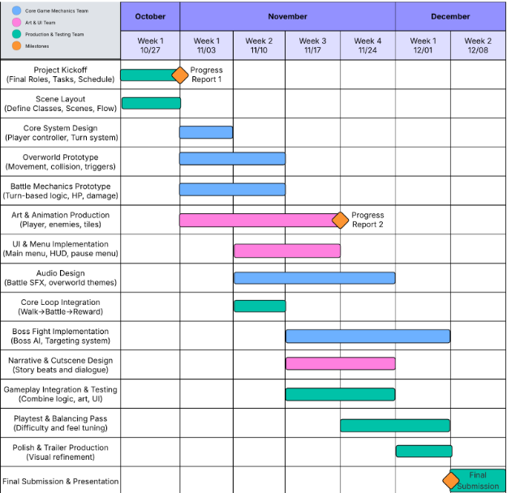

I gave a [document](https://docs.google.com/document/d/1YoH7Z_PgBjbDmCtEMcW1NmXPI1R2oIQrW8S-OWCqDtM/edit?tab=t.0) to our sole artist with many different references as a roadmap for how the artstyle for the main character as well as enemies should look like, and what items may need to be fulfilled.

[Ref link](https://www.polygon.com/23691285/stardew-valley-sprite-redesign-fan-art/)

[Ref link](https://www.deviantart.com/getsuei-h/art/Pokemon-Main-Character-Sprites-127050918)
[Ref link](https://www.reddit.com/r/earthbound/comments/nnrw5p/i_remastered_earthbound_sprites/)

I showed many sorts of references to how the characters should look like in the document, These references helped paint a good picture as to what the final game should look like. The turkeys and human characters all look pretty consistent with one another based on the style I suggested.

I mapped out what the overall map should look like. In the game, we call this the Unity Center located at UC Daniel. This picture I drew is based on the Memorial Union quad area at UC Davis. This is the general layout we chose for our campus.

## Game Feel

I am responsible for the logic of the player controls in the game overworld. I used input mapping for the controls of the game, as well as the logic of how the player will move.

I wanted the movement to be simple, but make it feel fun to move. I made sure to use the built in velocity system as well as the inputs as that the player has more than 4 directions to go in. It gives the player more freedom and lesss jankiness in how they stride. In the [player.gd](https://github.com/DrewCoding/179-Final-Project/blob/f9ecb4d94fabb1ab4b8353660adc9b45d61479e2/aggiemon/Scripts/player.gd#L32-L76), I made a character controller that was consistent with its speed in all 8 directions, so there is no chances of the player gaining unintended amounts of speed. 

Alongside the movement of the player, we also have the camera logic on the player. This is very straight forward, utilizing the built-in lerping when the camera follows the player in order to prevent possible motion sickness.

Here in the [camera script](https://github.com/DrewCoding/179-Final-Project/blob/f9ecb4d94fabb1ab4b8353660adc9b45d61479e2/aggiemon/Scripts/player_camera.gd#L3-L16), I made a boundary system to prevent the camera from going beyond the map. The camera smoothly stops in its tracks when it reaches the end of the map, and it still tracks the player when the player is moveing in an axis that hasn't reached its bounds yet.
Along with the camera boundaries, I made sure that there were actual boundaries on the map, creating colliders around the buildings, shop, and around the map borders to prevent both the enemies and player from stepping out.

## Other Contributions

I created the logic for the shop. There's a collider with [shop_collision.gd](https://github.com/DrewCoding/179-Final-Project/blob/f9ecb4d94fabb1ab4b8353660adc9b45d61479e2/aggiemon/Scripts/shop_collision.gd#L4-L30) in front of the storefront, such that when a player steps onto it and presses 'G', the shop menu will open and you can purchase moves with the skill points that you have.

Here in the [shop_menu.gd]() script, each item is placed into a skills Array, and they are individually placed into a grid. Each time a move is purchased successfully, the menu is updated until there are no more moves to buy. As for the items themselves, these are based upon the theme from our initial plan of the game, where we have a fun turn-based RPG in a UC Davis-like setting. These moves are recognizable things here at Davis, whether it's bubble tea or a class we all struggled in.

# Owen Ball

## User Interface and Input
EXAMPLES:

During development, I was responsible for the entire UI layer of the game. I began by creating the overworld pause menu, which required implementing pause logic, focus-based navigation, input accessibility, and a modular menu system capable of opening submenus without allowing background input. I then designed a visual UI theme using pixel-art borders, custom styleboxes, and Godot's theme resources to give the menus a cohesive aesthetic. The pixel-art designs were acquired from free asset packs found on itch.io, and required creating atlas textures to extract the precise assets I wanted to use. 

For functionality, I built the Stats Menu and Skills Menu from scratch. These read data from the player character at runtime, update dynamically, and include selection-based detail panels. The map menu required careful handling of image scaling and letterboxing. I also created the Options Menu, which includes working volume sliders wired into the game's audio buses. I also ensured consistent process modes so menus work while paused, and my constributions provided the game's entire interface layer, structured cleanly as reusable scenes and integrated smoothly with gameplay. I organized all UI scenes, scripts, and assets into its own UI folder within the game files. 

Input for the game is extremely simple and is simply mapped to wasd and arrow key movement, moving in the 4 cardinal directions and the ability to move in 8 directions when combining inputs. 

## Narrative Design

For the Narrative Design, I largely came up with the main premise of the story. I tied the story into the setting, being a parody of UC Davis, playing as a student, using different aspects of the City of Davis including restaurants and lectures as skills, with a backstory involving a haywire experiment in a on-campus lab, affecting the nearby local wildlife such as turkeys and squirrels. This is where the inspiration for the assets of the professor and enemies comes from. I also was responsible for adapting the story to meet any gameplay cuts we had to make, ensuring that whatever direction we went that the story would still have coherent structure, such as repurposing assets as boss battles, and changing lecture halls to simply be the farmers market stall to acquire skills. 

## Other Contributions
Throughout the project I added numerous polish features such as sound effects when navigating UI and integration with the dialogue textbox system so NPC speech automatically plays text audio. I also set up the animation player editor for the main character sprite when new assets were created, using region rects to manually edit the animation through the sprite sheet.  

# Abdulaziz Alhumaidy

## Game Logic

### Turn-Based Battle System Architecture

* Implemented the core turn-based combat system that manages battle flow, turn order, and state transitions. (Pius wrote the inital code structure which my implementation followed)
* Turn order is calculated based on character speed stats - faster characters act first and can attack multiple times if they significantly outspeed opponents.
* The battle manager uses a [current turn index](https://github.com/DrewCoding/179-Final-Project/blob/be959fde89f056280333db749cc1c9079bd3076b/aggiemon/Scripts/battle_manager.gd#L18) to cycle through combatants, with proper filtering to remove defeated characters from the turn queue.
* Implemented state transitions between player turns, enemy turns, and battle conclusion states using the [_next_turn() method](https://github.com/DrewCoding/179-Final-Project/blob/be959fde89f056280333db749cc1c9079bd3076b/aggiemon/Scripts/battle_manager.gd#L82-L99).
* The system [sorts turn order](https://github.com/DrewCoding/179-Final-Project/blob/be959fde89f056280333db749cc1c9079bd3076b/aggiemon/Scripts/battle_manager.gd#L49-L55) to ensure the player always acts first, then orders remaining characters by speed.
* Battle system emits a [`battle_ended` signal](https://github.com/DrewCoding/179-Final-Project/blob/be959fde89f056280333db749cc1c9079bd3076b/aggiemon/Scripts/battle_manager.gd#L20) when combat concludes, allowing the game manager to handle scene transitions back to the overworld.

### Attack and Damage Calculation System

* Created the [AttackSystem class](https://github.com/DrewCoding/179-Final-Project/blob/be959fde89f056280333db749cc1c9079bd3076b/aggiemon/Scripts/attack_system.gd) using static methods for easy access throughout the battle system.
* The [calculate_damage() method](https://github.com/DrewCoding/179-Final-Project/blob/be959fde89f056280333db749cc1c9079bd3076b/aggiemon/Scripts/attack_system.gd#L5-L17) implements the damage formula: `damage = base_attack - (defense * 0.5)`, with random variance between 85-100%. It still ensures minimum damage of 1 to prevent zero-damage hits.

### Character Health Management with Signal System

* Implemented a signal-based health system in the [Character base class](https://github.com/DrewCoding/179-Final-Project/blob/be959fde89f056280333db749cc1c9079bd3076b/aggiemon/Scripts/character.gd) that both Player and Enemy inherit from.
* The [take_damage() method](https://github.com/DrewCoding/179-Final-Project/blob/be959fde89f056280333db749cc1c9079bd3076b/aggiemon/Scripts/character.gd#L30-L35) emits a [`health_changed` signal](https://github.com/DrewCoding/179-Final-Project/blob/be959fde89f056280333db749cc1c9079bd3076b/aggiemon/Scripts/character.gd#L15) that UI components can subscribe to for automatic updates.
* When health reaches zero, a [`died` signal](https://github.com/DrewCoding/179-Final-Project/blob/be959fde89f056280333db749cc1c9079bd3076b/aggiemon/Scripts/character.gd#L16) is emitted to trigger death handling logic.
* The [is_alive() method](https://github.com/DrewCoding/179-Final-Project/blob/be959fde89f056280333db749cc1c9079bd3076b/aggiemon/Scripts/character.gd#L37-L38) is used by the battle manager to filter defeated characters from turn order.
* For example, [health_bar.gd subscribes to health_changed](https://github.com/DrewCoding/179-Final-Project/blob/be959fde89f056280333db749cc1c9079bd3076b/aggiemon/Scripts/health_bar.gd#L9-L11) to automatically update health bar displays during combat.

### Battle Victory and Defeat Conditions

* Implemented the [_check_battle_end() method](https://github.com/DrewCoding/179-Final-Project/blob/be959fde89f056280333db749cc1c9079bd3076b/aggiemon/Scripts/battle_manager.gd#L100-L118) that evaluates win/loss conditions after each turn.
* The system iterates through all combatants, validates they're still alive using `is_instance_valid()`, and categorizes them as player or enemies.
* If no enemies remain alive, [_on_battle_won()](https://github.com/DrewCoding/179-Final-Project/blob/be959fde89f056280333db749cc1c9079bd3076b/aggiemon/Scripts/battle_manager.gd#L162-L165) is triggered.
* If the player is defeated, [_on_battle_lost()](https://github.com/DrewCoding/179-Final-Project/blob/be959fde89f056280333db749cc1c9079bd3076b/aggiemon/Scripts/battle_manager.gd#L167-L170) is triggered.
* Both callbacks include delays for dramatic effect before emitting the `battle_ended` signal.

### Simple Enemy AI and Targeting System

* Created the [choose_attack() method](https://github.com/DrewCoding/179-Final-Project/blob/be959fde89f056280333db749cc1c9079bd3076b/aggiemon/Scripts/enemy.gd#L25-L29) in the Enemy class for automatic target selection.
* The AI searches for player characters using `get_tree().get_nodes_in_group("player")` and returns the first valid target.
* During [enemy turns](https://github.com/DrewCoding/179-Final-Project/blob/be959fde89f056280333db749cc1c9079bd3076b/aggiemon/Scripts/battle_manager.gd#L149-L160), the battle manager calls this targeting method and executes attacks with appropriate delays between action and resolution.
* Delays of 1 second are used before and after enemy attacks to create readable, dramatic combat flow.

### Battle Mode State Management

* Implemented the battle mode flag system that prevents player movement during combat.
* The player script tracks an [`in_battle` boolean](https://github.com/DrewCoding/179-Final-Project/blob/be959fde89f056280333db749cc1c9079bd3076b/aggiemon/Scripts/player.gd#L9) that [blocks input processing](https://github.com/DrewCoding/179-Final-Project/blob/be959fde89f056280333db749cc1c9079bd3076b/aggiemon/Scripts/player.gd#L16-L17) when true.
* The [set_battle_mode() method](https://github.com/DrewCoding/179-Final-Project/blob/be959fde89f056280333db749cc1c9079bd3076b/aggiemon/Scripts/player.gd#L13-L14) allows the game manager to toggle this state.
* The game manager [sets this flag when battles start](https://github.com/DrewCoding/179-Final-Project/blob/be959fde89f056280333db749cc1c9079bd3076b/aggiemon/Scripts/game_manager.gd#L39) and [clears it when battles end](https://github.com/DrewCoding/179-Final-Project/blob/be959fde89f056280333db749cc1c9079bd3076b/aggiemon/Scripts/game_manager.gd#L54).

## Gameplay Testing

### Full Results
[Link to full gameplay test results](https://docs.google.com/document/d/1Gd3-SF3Oj1tHF9o9kuKQIqrCpmDOJJtyu9twnDr5Txg/edit?tab=t.0)

### Key Findings

**User Interface and Combat Flow:**
- The fight UI was well-received overall, but one player noted that "selecting the enemy target is a bit clunky and detached from the enemy sprite. Some visual connection would add to the UI feel."
- Players suggested adding flavor text or different sound effects based on attack effectiveness, noting that "some flavor text/different sounds depending on if the attack was super effective/not very effective would be nice."
- **Post-demo improvements:** Enhanced battle UI with improved visual elements, added button click sound effects during combat, and created proper Start/Game Over screens with animations.

**World Building and Immersion:**
- The UC Davis theming was praised, one tester said: "I loved the UC Davis theming-- I thought it was really clever and added a fun twist to the game."
- Players felt the game world needed more content, with suggestions to "add more interactive characters to make the game world feel richer and more engaging."
- **Post-demo improvements:** Integrated complete final map with proper boundaries, added NPC dialogue system with Professor and Merchant characters, and positioned multiple turkey enemies throughout the world.

**Game Feel and Polish:**
- The turn-based combat was described as "really cool" with "animations and visual indicators throughout, as well as a soundtrack, making the game a pretty immersive experience."
- Players noted some technical issues: "The trees have no collision and the scene changes lack transitions."
- **Post-demo improvements:** Fixed tree collision issues, added multiple music tracks for different game states, implemented audio options menu with volume controls, and added dialogue/UI sound effects.

**Gameplay Mechanics:**
- One player suggested making combat more dynamic: "Adding like a real time event during battle to dodge or counter would be really cool and make the game very attention grabbing."
- The suggestion to "give the player a companion would make the game more interactive" was offered to combat the "static combat" feel.
- **Post-demo improvements:** Added shop system for purchasing skills with skill points, implemented complete level-up system with growth rates, created additional skills (Calculus, Egg Slam, iTea), and added Greaser Turkey boss as final challenge.

**Overall Reception:**
- Players were liked the concept, with one commenting: "Lovely concept and implementation... I think you'll end up with a great game if you sell the story (fighting professors) and make a way to win the game."
- Testers were "looking forward to seeing what gets added" to the game world and excited about the final product with story completion and boss encounters.

While some suggestions (real-time dodge/counter mechanics, companion system, additional random items) were not implemented due to time constraints, the core feedback about polish, world building, and gameplay clarity was addressed in the final version.

## Other Contributions

Mainly assisted the team with various tasks such as:

* Helped integrate the directional animation sprites made for the turkey enemies in [turkey.gd](https://github.com/DrewCoding/179-Final-Project/blob/2003d836b1fa1e1cae65eb06b6c0c28ed5e2f9d6/aggiemon/Scripts/turkey.gd).

* Updated the collision boundries around new structures added in the new map [new_map_test.tscn](https://github.com/DrewCoding/179-Final-Project/blob/2003d836b1fa1e1cae65eb06b6c0c28ed5e2f9d6/aggiemon/Scenes/new_map_test.tscn).
* Assisted with NPC development by updating the NPC animations(professor, merchant, turkeys) ann positioning NPCs throughout the game world. Also created the scenes for the professor and merchant and added the relevant narrative texts made by the narrator to the characters.

* Modified the health bar system to [subscribe to health_changed signals](https://github.com/DrewCoding/179-Final-Project/blob/be959fde89f056280333db749cc1c9079bd3076b/aggiemon/Scripts/health_bar.gd#L9-L11).
* The [_on_health_changed() callback](https://github.com/DrewCoding/179-Final-Project/blob/be959fde89f056280333db749cc1c9079bd3076b/aggiemon/Scripts/health_bar.gd#L13-L17) automatically updates the progress bar and label text.
* Creates real-time visual feedback during combat without manual update calls.

Photo of health bar before and after recieving damage:
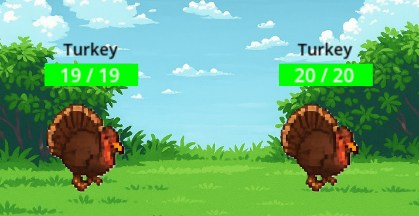

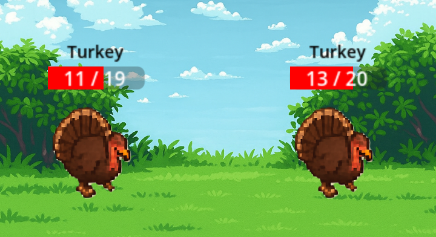

### Bug Fixes and Polish

* Fixed player movement direction issues in [commit 237080e](https://github.com/DrewCoding/179-Final-Project/commit/237080e).
* Resolved NPC interaction bugs in [commit 98f5c5d](https://github.com/DrewCoding/179-Final-Project/commit/98f5c5d).

# Liz Voloshin

## Animation and Visuals

- The sprites and animations were done using Krita, which is an open source software for art. Some sprites needed to be resized and the animations needed to be assembled into a spritesheet, which was done using Gimp since they have a resizing tool that doesn't blur image when you enlarge them. 

- I created the main map in which the character moves around, which includes the "unity Center", a food cart where the character encounters the merchant, the laboratory where the final boss is defeated, and a small building which initally was going to be used as a lecture hall. 

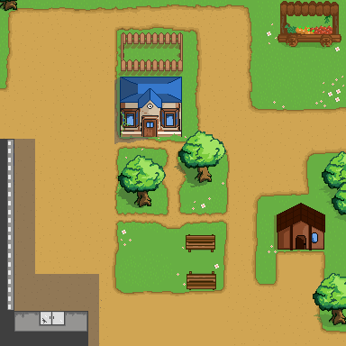

- For the character, I designed the walking animation for front facing walking, side, and back. There is also an idle animation for each of these poses. On top of creating the animations for the character, I assembled them into sprite sheets.

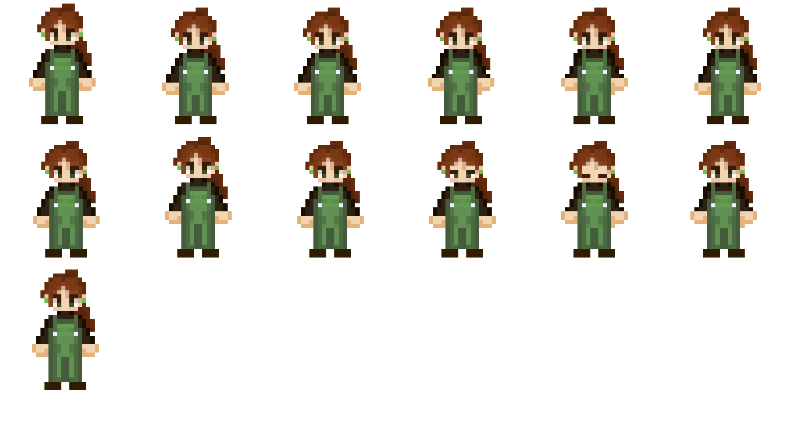 

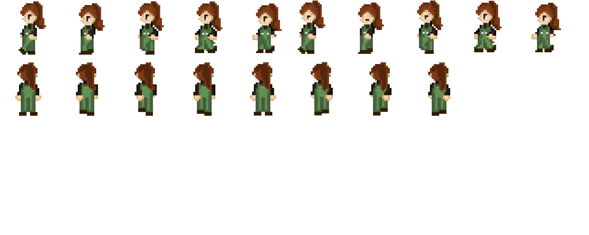

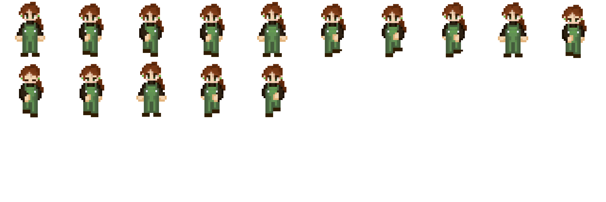

- For the enemies, I created the two turkey bosses (both designed to look like 80s bikers), and a mini squirrel boss. I was also responsible for animating them. 
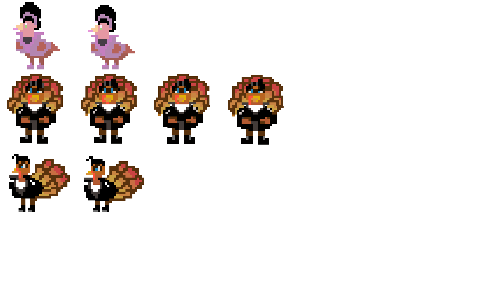 

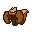

- Finally, I created two of the NPCs that the player interacts with: the professor and the merchant. 

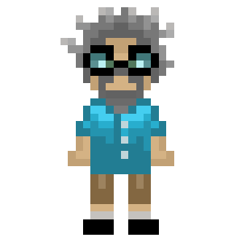

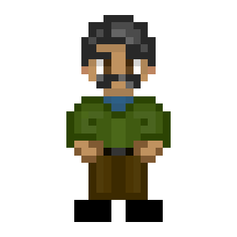

- The only sprites that I didn't directly create are the sample turkey and the attack animation:

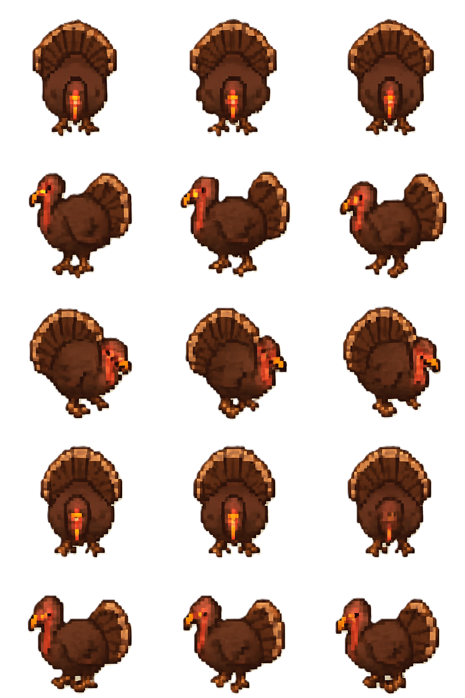

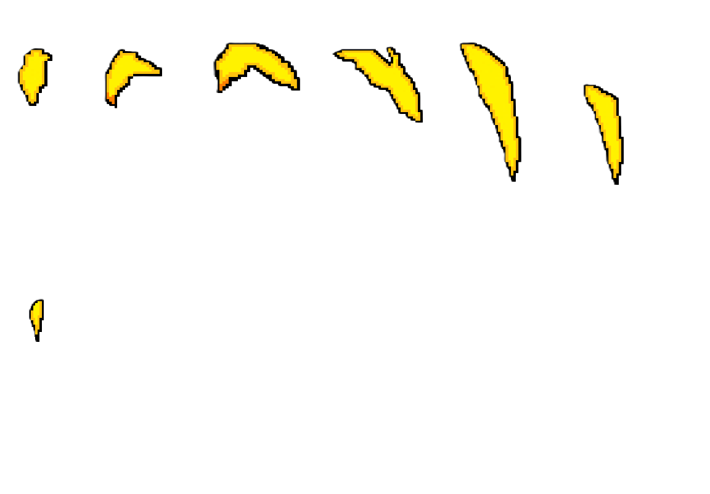

- The feel that this game was going for was meant to intersect between Pokemon and Stardew valley, and I feel that it acheives that through the softer colors and pixel style that I used for the characters. With world-building in mind, I tried to make the map with a road that led the character to where they are meant to go. 

## Gameplay Testing

Link to the results of the gameplay test: [Link to Gameplay Test Document](https://docs.google.com/document/d/11KGVy2KtiswyZcIPhHo343gZ_qPnjs1r_493kMJ2Gv0/edit?usp=sharing)

The main findings are that the game functions fairly well, with all the basic funcionalities working as intended. However, a few bugs were discovered during my play of the game, and they included: 
- The game freezing when the audio settings were toggled. 
- The music in the main world randomly stopping (however, this could also be a result of the software as I struggled to recreate this bug).
- The enemy sprites hovering slightly before decding into the battle scene. 
- Player able to walk on top of trees that were placed in the corners of the map (less of a bug and more of a visual inconcistency)

However, other than these issues, the game functions as intended and didn't have any other glaring issues. 

## Other Contributions

# Pius Omolewa

## Game Logic

- I created the Gamemanager which essentially handles the transition between the over world and the battle screen. I also designed the encounter mechanism and the BattleSetup scene which allows for random enemy encounters. The BattleSetUp node guarantees the collided enemy is always created first. It will then choose to randomly generate 1 to 2 enemies for combat with up to 3 possible enemies. In combat the enemy ai is simple. The default turkey is designed to use turkey slap when the player's defense is over 75%, otherwise it choses either turkey slap or punch at random. The boss functions similarly but instead has the added move greaser punch. Generally the Tukey enemies will have a higher defense and hp but less speed and attack. The "Cooler Turkey" generally has a higher speed but less defenses.

- The logic for the buttons in the battle screen were also handled by me, including the system which maps the enemies in combat with the buttons in the combat command menu. At battle set up each enemy is mapped to a button that gets updated every time an enemy dies. If there are duplicate enemies the name on the button will reflect that. For example if there are two turkeys their buttons will be named Turkey and Turkey 2 respectively.

- I was also responsible for creating the base enemy and player classes. Each enemy and player build off of the same character class but have different stats and skills. PlayerInfo is an auto load I added to help with player referencing and the level up mechanics. 

- Added a tether to overworld enemy movements so they stay within an area. Lerp calculations are used to keep the enemy tethered to a 100 x 100 pixel area.

- Enemy shake and combat effect were added by me. When an enemy attacks their sprite will move forward a few pixels and the universal attack sound effect will play before moving back. Upon taking damage the player will play their attack effect and the enemy that they hit will shake back and forth to simulate impact.

- Added a respawn system that respawns enemies after 30 seconds. During the start of each battle the enemy that iniciated the combat shares it's spawner id with the BattleSetup node. At the end of combat the spawner at that particular id is told to create a new instance of that enemy and add it to the world

- The level up system was also created by me. The player is assigned a random growth rate type at the start of each game that effects the probability that a specific stat levels up. The default growth rate sees that each stat has a 50% chance of increasing on level up. The aggressive and defensive rates have a higher probability of rising either attack or defense related stats at the cost of stats not related to them. This system was inspired by Fire Emblem but stat increases are generally higher. There is also a scaling mechanic where Enemies will increase in difficulty and xp gain based on the players current level.

- I also created the base skill template and created the default punch (combo) skill and the "Turkey Slap" and "Greaser Punch" skills. Turkey slap lowers the player's defense by 25% but in general doesn't do much damage. Greaser Punch is the bosses move and does a high amount of damage. 

scripts:
- [BattleSetUp](https://vscode.dev/github/DrewCoding/179-Final-Project/blob/main/aggiemon/Scripts/battle_set_up.gd#L1)
- [BattleManager](https://vscode.dev/github/DrewCoding/179-Final-Project/blob/main/aggiemon/Scripts/battle_manager.gd#L1-L2) (Aziz contributed to the damage calculation and beta version of the turn order)
- [attack_effect](https://vscode.dev/github/DrewCoding/179-Final-Project/blob/main/aggiemon/Scripts/attack_effect.gd#L1)
- [Character](https://vscode.dev/github/DrewCoding/179-Final-Project/blob/main/aggiemon/Scripts/character.gd#L1)
- [enemy_creator](https://vscode.dev/github/DrewCoding/179-Final-Project/blob/main/aggiemon/Scripts/enemy_creator.gd#L1)
- [enemy_spawner](https://vscode.dev/github/DrewCoding/179-Final-Project/blob/main/aggiemon/Scripts/enemy_spawner.gd#L1)
- [skill_button](https://vscode.dev/github/DrewCoding/179-Final-Project/blob/main/aggiemon/Scripts/skill_button.gd#L1)
- Contributions were also made to the player, turkey, enemy, and greaserturkey scripts
- Enemy Skills folder (turkey slap and greaser punch)

## Audio
Audio was not made by me.

Sound Effect by <a href="https://pixabay.com/users/freesound_community-46691455/?utm_source=link-attribution&utm_medium=referral&utm_campaign=music&utm_content=87839">freesound_community</a> from <a href="https://pixabay.com/sound-effects//?utm_source=link-attribution&utm_medium=referral&utm_campaign=music&utm_content=87839">Pixabay</a>

Music:

TItle: 8 Bit Boss
Artist:HeatleyBros
Writer:Brett Heatley, ASCAP
Publisher:Heatley Music Publishing, ASCAP
Label:Kyzen Music
<a href="https://www.youtube.com/watch?v=hgzlmu0K3YI">link</a>

"Dragon Castle" by @Makai-symphony <a href = "https://www.youtube.com/watch?v=9gBTKiVqprE">link</a>

Jorge Hernandez - "Chopsticks" <a href = "https://www.youtube.com/watch?v=G-FGiICah8Q&list=PLwJjxqYuirCLkq42mGw4XKGQlpZSfxsYd&index=9">link</a>

# Nathan Castellon

## Narrative Design

My contributions as Narrative Designer were mainly towards finding ways to explain why the player was doing what they were doing in the game. As during development we had ideas to what we wanted the player to do but didn't take into considereation the in game implications of those ideas. To help with this I wrote a rough draft of a [design document](https://drive.google.com/file/d/1Nk1zH_yumkaOe5IAF8cH9WA4CxWkWw8d/view?usp=sharing) outlining potential ways to convey the story including cutscene references, potential story pitches, gameplay pathways, and dialogue. The purpose of this document was to get feedback from the group on what elements we wanted to go for since the document was made earlier on in the development process. Since then the document has been updated to the one now linked in under project resources. From there we decided to include dialogue but no cutscenes. This way the narrative could be told if the player wants to know about but allows the player to roam freely and not be abide by a linear gameplay pathway. 

For the in game narrative logic, I created and implemented the functionality of the dialogue box. This includes [TextboxLayer.tscn](aggiemon/Scenes/TextboxLayer.tscn), [textbox.tscn](aggiemon/Scenes/textbox.tscn) scenes, and the corresponding script [textbox_layer.gd](aggiemon/Scripts/textbox_layer.gd). I used the help of a youtube tutorial (linked above) to help myself get started but the video was extremely old and outdated. I initially trying implementing a dialogue animation of having it typed out like it does in Undertale using tween but I couldn't get Tween to work with Lable, most likely due to the node structure I had going on. So I instead opted to use a simple [for loop](https://github.com/DrewCoding/179-Final-Project/blob/11d487f000f1a41c14b50adfd32f68b53a8a7eef/aggiemon/Scripts/textbox_layer.gd#L26) that linearly displays text by `_num_visible_character_per_loop`. While this implementation isn't ideal but for our script it works perfectly fine. Additionally, I implemneted functionality so that the dialogue would appear when the player gets close to the NPC's. This required the creation of a [speak_box](https://github.com/DrewCoding/179-Final-Project/blob/11d487f000f1a41c14b50adfd32f68b53a8a7eef/aggiemon/Scripts/game_manager.gd#L20). Along with [code](https://github.com/DrewCoding/179-Final-Project/blob/11d487f000f1a41c14b50adfd32f68b53a8a7eef/aggiemon/Scripts/game_manager.gd#L35) to game_manager.gd to start the dialogues, however this code ended up being commented out due to bugs when being exported to itch.io. 

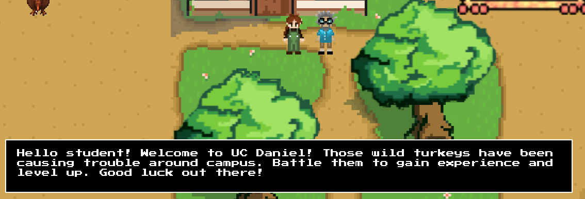

I was hoping that my implementation of dialogue would add to games theming and narrative via it's presentation,

## User Interface

My contributions as User Interface are as follows. I created the scene and scripts for [Start Menu](aggiemon/Scripts/startmenu.gd) and [Game Over](aggiemon/Scripts/gameover_menu.gd) Menu, and added battle_UI elements. For Start menu, I used a youtube video(linked above) to help get me started, and served as the foundation for how I implemented the everything else. 
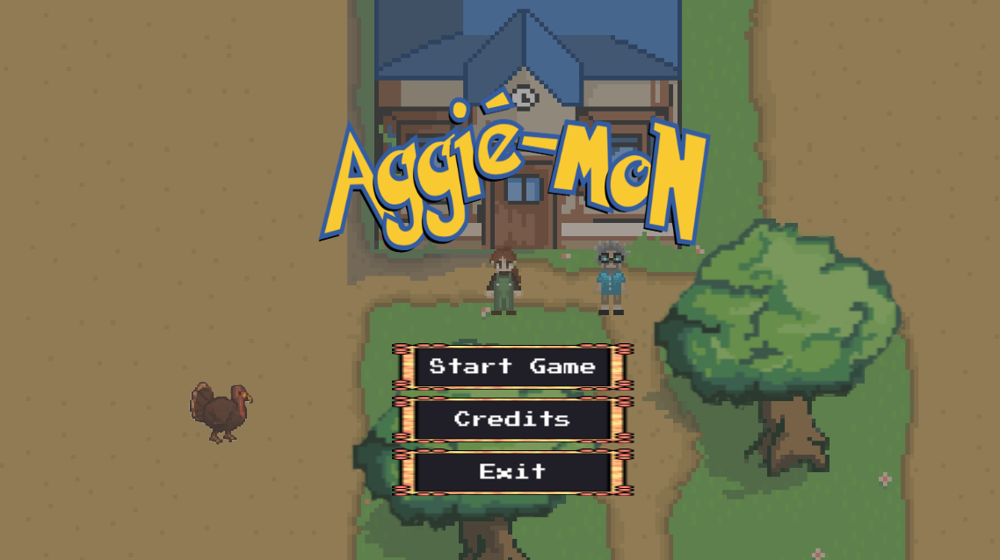

The reason why I wanted to make the start screen a transparent background is because I am personally not very good at art design, and the art work made by our sole art_director did an amazing job at developing the maps and sprites for the game. So I thought a transparent background for the start menu would be an excellent choice. For whatever reason our tres files wouldn't work as a texture on the buttons so for implementing that I made child nodes underneath the buttons as reactextures and added them there then made the necessary changes to make them visible and interactable. For the logo, I used a generic font generator from [here](https://pokemon-fonts-generator.netlify.app). 
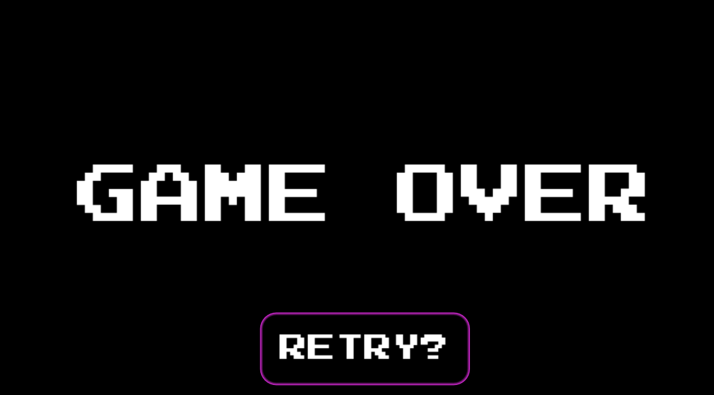
For the game over menu it's a similar scenario to the start over except with the instance of the player so that it can track whenever the player's health is at zero so that it can show and turn off the player's movement. [Here](https://github.com/DrewCoding/179-Final-Project/blob/55d2fef156517a58321ce8900f454fd6c0d87d9a/aggiemon/Scripts/gameover_menu.gd#L13). 
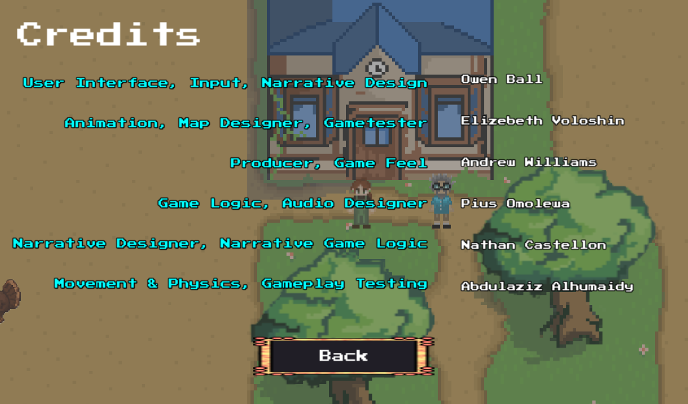
I also added a credits page which might be a little outdated since some of us decided to change our roles to better suit the work we did on the project.

Lastly, for the battle UI I didn't want to re-use the limited textures we had and I didn't want to ask our sole art lead to do even more drawing than she was already doing so I drew the art myself on a website called pixilart.com. It's completely free and I think it turned out ok. 

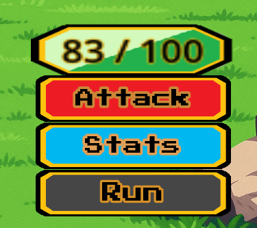

## Other Contributions

I decided to add some sound bites to button clicks during combat to add more Juice. I did this by simplying making a new node for audiostreaming2 and then reusing one of our old sound bites but pitching it up by 33%. Resulting in a satisfying chime noise when clicking buttons. Then I simply added a couple of lines of code to battle_manager to make it go off during clicks, [1](https://github.com/DrewCoding/179-Final-Project/blob/e008d7ca3a152be4a36fedb3085f8d856ecf8877/aggiemon/Scripts/battle_manager.gd#L45)[2](https://github.com/DrewCoding/179-Final-Project/blob/e008d7ca3a152be4a36fedb3085f8d856ecf8877/aggiemon/Scripts/battle_manager.gd#L74)[3](https://github.com/DrewCoding/179-Final-Project/blob/e008d7ca3a152be4a36fedb3085f8d856ecf8877/aggiemon/Scripts/battle_manager.gd#L91)[4](https://github.com/DrewCoding/179-Final-Project/blob/e008d7ca3a152be4a36fedb3085f8d856ecf8877/aggiemon/Scripts/battle_manager.gd#L94). I believe this added a little bit more juice and improved game feel during combat which is where the player would be spending the majority of their time in. 
