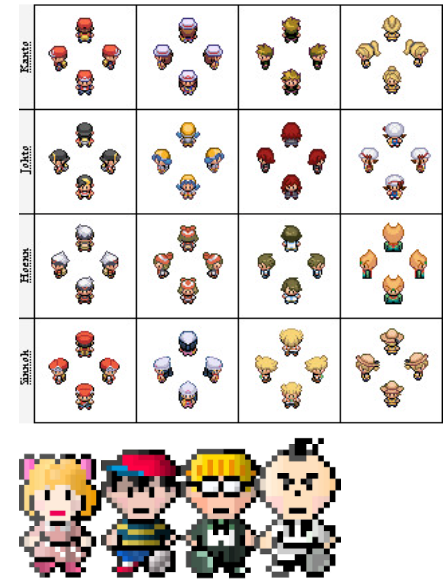
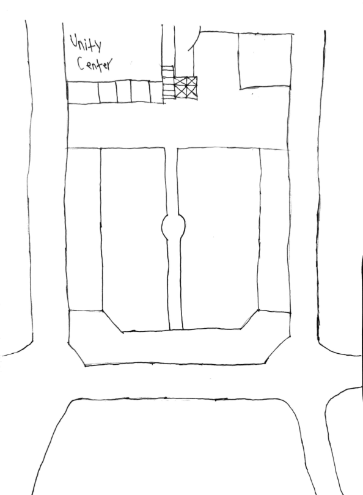
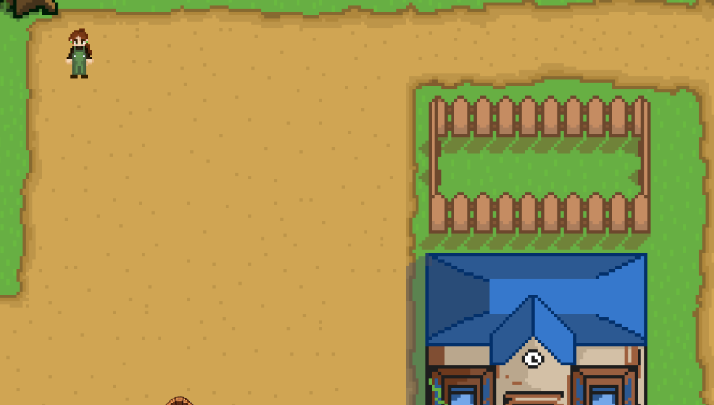
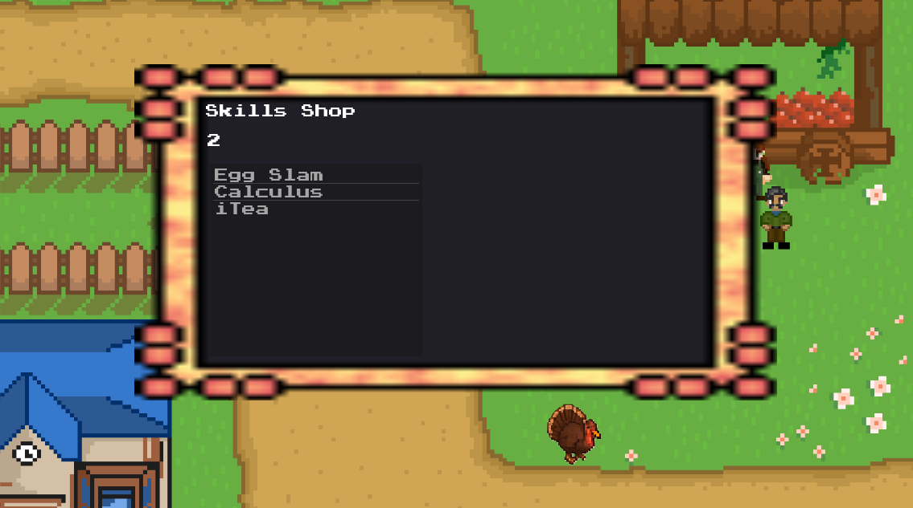

# The title of your game #

## Summary ##

Welcome student to your first year at UC Daniel! Home of the egg heads, the Unity Center, and.... angry tukerys? The campus is being overruned by angry turkeys. The turkeys can no longer tolerate UC Daniel and its student’s occupation of their home. The turkey's are now running rampant and some turkeys have even begun to evolve. They seem to be evolving, growing stronger to cause mayhem. Utilize classic turn-based combat to defeat the turkeys! Level up to gain skill points that you can use to buy skills in the shop to make yourself even more powerful. Rise to the occassion young student and defeat the mighty Greaser Turkey!

## Project Resources

[Aggiemon](https://dewr.itch.io/aggiemongame)

[Aggiemon: Initial Plan](https://docs.google.com/document/d/1Pxu2SCOGyYEG6GSh6JUOVhdXDLNHENb92KxZskyjqv4/edit?usp=sharing)

[Aggiemon: Narrative Design Document](https://docs.google.com/document/d/1BEIbeEAhaNuGrf57vaDcD2oR74V2yJCS9DSDmFLlZ3w/edit?usp=sharing)

## Gameplay Explanation

After you have pressed the start button, you are able to move around using WASD and find turkeys roaming around the place. When you walk into one, a fight commences! You have three options: Attack, Stats, and Run. When you click on Attack, you are able to choose an attack, then you can choose which turkey to inflict that attack. After you decide who to attack, damage is done to the turkey. The turkey will then have their turn to attack you. You and the turkeys have stats, one of these stats being speed, an important part of battle. If the player has a higher speed, the player gets to attack the turkey twice, and vice versa. After you have defeated the turkeys in battle, you will have gained a skill point, as well as leveling up. What you can do with the skill points that you gain in battle is going to the shop, located at the top right of the map. When you press 'G' at the shop, next to the NPC, you can choose to buy certain sets of skills that have higher boosts of damage and effects on the player and enemy. When you have a lot of strength, fighting enemies is far easier. You may even be able to defeat a certain greaser at the bottom left of the map...

- Player can use W A S D or the arrow keys to move

- Pressing the space bar + the up arrow key is a cheat allowing the player to level up manually 

- Leveled stats increase based on by growth rates (similar to Fire Emblem) which are randomly decided at the start of each game

- Turn order is determined by speed. If a character outspeeds they get to attack again so slower enemies are incentivized to be targeted first. 

- Defeating all enemies in combat allows players to gain xp and level up but running from combat yields no xp

- Player is only allowed to heal through leveling up and thorugh one obtainable skill

- After leveling up and acquiring skills from the shop the player should be able to beat the boss at level 10

**Add it here if you did work that should be factored into your grade but does not fit easily into the proscribed roles! Please include links to resources and descriptions of game-related material that does not fit into roles here.**

# External Code, Ideas, and Structure #

The battle background and "Turkey" enemy sprite were generated using Stable Diffusion.

Tutorials

- https://www.youtube.com/watch?v=QEHOiORnXIk&t=374s
- https://www.youtube.com/watch?v=zHYkcJyE52g

# Main Roles

Andrew Williams

Main Role: Producer

Sub Role: Game Feel

Liz Voloshin

Main Role: Animation and Visuals

Sub Role: Gameplay Testing

Pius Omolewa

Main Role: Game Logic

Sub Role: Audio

Abdulaziz Alhumaidy

Main Role: Movement and Physics

Sub Role: Gameplay Testing

Nathan C

Main Role: Game Logic

Sub Role: Game Feel + trailer

Owen Ball

Main Role: User Interface and Input

Sub Role: Narrative Design

Your goal is to relate the work of your role and sub-role in terms of the content of the course. Please look at the role sections below for specific instructions for each role.

Below is a template for you to highlight items of your work. These provide the evidence needed for your work to be evaluated. Try to have at least four such descriptions. They will be assessed on the quality of the underlying system and how they are linked to course content. 

*Short Description* - Long description of your work item that includes how it is relevant to topics discussed in class. [link to evidence in your repository](https://github.com/dr-jam/ECS189L/edit/project-description/ProjectDocumentTemplate.md)

Here is an example:  
*Procedural Terrain* - The game's background consists of procedurally generated terrain produced with Perlin noise. The game can modify this terrain at run-time via a call to its script methods. The intent is to allow the player to modify the terrain. This system is based on the component design pattern and the procedural content generation portions of the course. [The PCG terrain generation script](https://github.com/dr-jam/CameraControlExercise/blob/513b927e87fc686fe627bf7d4ff6ff841cf34e9f/Obscura/Assets/Scripts/TerrainGenerator.cs#L6).

You should replay any **bold text** with your relevant information. Liberally use the template when necessary and appropriate.

## Producer

When producing for our project, I would always want to touch base with the team as best as I could. I found that when2meet was a great tool to get everyone's general schedule for this quarter and when we all have some sort of spare time with this [link](https://www.when2meet.com/?32872303-4PPDT). We also have a private discord group chat dedicated to the development of Aggiemon, so we would be able to not only set up meetings, but exchange ideas, offer assistance to one another, and show off progress. I helped to keep the team organized and active, to make progress as smooth as possible.

We kept records of progress through GitHub. I created this repository to stay organized while continuing development. We had a few branches that was dedicated to the user-interface, sound effects, and art. I helped to map out our progress throughout the development cycle, alongside Aziz to make a Gant chart for our project. It's based on our five week deadline that we had to create the project. It gave us a very good gauge as to how we were doing schedule wise, and how much still needed to be completed.

I gave a [document](https://docs.google.com/document/d/1YoH7Z_PgBjbDmCtEMcW1NmXPI1R2oIQrW8S-OWCqDtM/edit?tab=t.0) to our sole artist with many different references as a roadmap for how the artstyle for the main character as well as enemies should look like, and what items may need to be fulfilled.

[Ref link](https://www.polygon.com/23691285/stardew-valley-sprite-redesign-fan-art/)

[Ref link](https://www.deviantart.com/getsuei-h/art/Pokemon-Main-Character-Sprites-127050918)
[Ref link](https://www.reddit.com/r/earthbound/comments/nnrw5p/i_remastered_earthbound_sprites/)

I showed many sorts of references to how the characters should look like in the document, These references helped paint a good picture as to what the final game should look like. The turkeys and human characters all look pretty consistent with one another based on the style I suggested.

I mapped out what the overall map should look like. In the game, we call this the Unity Center located at UC Daniel. This picture I drew is based on the Memorial Union quad area at UC Davis. This is the general layout we chose for our campus.

## Game Feel

I am responsible for the logic of the player controls in the game overworld. I used input mapping for the controls of the game, as well as the logic of how the player will move.

I wanted the movement to be simple, but make it feel fun to move. I made sure to use the built in velocity system as well as the inputs as that the player has more than 4 directions to go in. It gives the player more freedom and lesss jankiness in how they stride. In the [player.gd](https://github.com/DrewCoding/179-Final-Project/blob/f9ecb4d94fabb1ab4b8353660adc9b45d61479e2/aggiemon/Scripts/player.gd#L32-L76), I made a character controller that was consistent with its speed in all 8 directions, so there is no chances of the player gaining unintended amounts of speed. 

Alongside the movement of the player, we also have the camera logic on the player. This is very straight forward, utilizing the built-in lerping when the camera follows the player in order to prevent possible motion sickness.

Here in the [camera script](https://github.com/DrewCoding/179-Final-Project/blob/f9ecb4d94fabb1ab4b8353660adc9b45d61479e2/aggiemon/Scripts/player_camera.gd#L3-L16), I made a boundary system to prevent the camera from going beyond the map. The camera smoothly stops in its tracks when it reaches the end of the map, and it still tracks the player when the player is moveing in an axis that hasn't reached its bounds yet.
Along with the camera boundaries, I made sure that there were actual boundaries on the map, creating colliders around the buildings, shop, and around the map borders to prevent both the enemies and player from stepping out.

## Other Contributions

I created the logic for the shop. There's a collider with [shop_collision.gd](https://github.com/DrewCoding/179-Final-Project/blob/f9ecb4d94fabb1ab4b8353660adc9b45d61479e2/aggiemon/Scripts/shop_collision.gd#L4-L30) in front of the storefront, such that when a player steps onto it and presses 'G', the shop menu will open and you can purchase moves with the skill points that you have.

Here in the [shop_menu.gd]() script, each item is placed into a skills Array, and they are individually placed into a grid. Each time a move is purchased successfully, the menu is updated until there are no more moves to buy. As for the items themselves, these are based upon the theme from our initial plan of the game, where we have a fun turn-based RPG in a UC Davis-like setting. These moves are recognizable things here at Davis, whether it's bubble tea or a class we all struggled in.

**Describe the steps you took in your role as producer. Typical items include group scheduling mechanisms, links to meeting notes, descriptions of team logistics problems with their resolution, project organization tools (e.g., timelines, dependency/task tracking, Gantt charts, etc.), and repository management methodology.**

## User Interface and Input

**Describe your user interface and how it relates to gameplay. This can be done via the template.**
**Describe the default input configuration.**

**Add an entry for each platform or input style your project supports.**

## Movement/Physics

**Describe the basics of movement and physics in your game. Is it the standard physics model? What did you change or modify? Did you make your movement scripts that do not use the physics system?**

## Animation and Visuals

**List your assets, including their sources and licenses.**

**Describe how your work intersects with game feel, graphic design, and world-building. Include your visual style guide if one exists.**

## Game Logic

**Document the game states and game data you managed and the design patterns you used to complete your task.**

I designed the most of the battle system expect for the AttackSystem which was the damage calculation. I created the Gamemanager which essentially handles the transition between the over world and the battle screen. I also designed the encounter mechanism and the BattleSetup scene which allows for random enemy encounters. The BattleSetUp node guarantees the collided enemy is always created first. It will then choose to randomly generate 1 to 2 enemies for combat with up to 3 enemies. I also handled the logic for the buttons in the battle screen, including the system which maps the enemies in combat with the buttons in the combat command menu. 

I was also responsible for creating the base enemy and player classes. Each enemy and player build off of the same character class but have different stats and skills. PlayerInfo is an auto load I added to help with player referencing and level up mechanics.

I created the base skill template and created the default punch (combo) skill and the "Turkey Slap" and "Greaser Punch" skills.

The level up system was also created by me. The player is assigned a random growth rate type at the start of each game that effects the probability that a specific stat levels up. This system was inspired by Fire Emblem but stat increases are generally higher. There is also a scaling mechanic where Enemies will increase in difficulty based on the players current level.

# Sub-Roles

## Audio

Audio was not created by me instead I used the free assests listed below:

Sound Effect by <a href="https://pixabay.com/users/freesound_community-46691455/?utm_source=link-attribution&utm_medium=referral&utm_campaign=music&utm_content=87839">freesound_community</a> from <a href="https://pixabay.com/sound-effects//?utm_source=link-attribution&utm_medium=referral&utm_campaign=music&utm_content=87839">Pixabay</a>

Music:

TItle: 8 Bit Boss
Artist:HeatleyBros
Writer:Brett Heatley, ASCAP
Publisher:Heatley Music Publishing, ASCAP
Label:Kyzen Music
<a href= "https://www.youtube.com/watch?v=hgzlmu0K3YI&themeRefresh=1"> Link </a>

"Dragon Castle" by @Makai-symphony <a href= "https://www.youtube.com/watch?v=9gBTKiVqprE"> Link </a>

Jorge Hernandez - Chopsticks <a href= "https://www.youtube.com/watch?v=G-FGiICah8Q&list=PLwJjxqYuirCLkq42mGw4XKGQlpZSfxsYd&index=10"> Link </a>

**Document the sound style.** 

## Gameplay Testing

**Add a link to the full results of your gameplay tests.**

**Summarize the key findings from your gameplay tests.**

## Narrative Design

**Document how the narrative is present in the game via assets, gameplay systems, and gameplay.** 

## Press Kit and Trailer

**Include links to your presskit materials and trailer.**

**Describe how you showcased your work. How did you choose what to show in the trailer? Why did you choose your screenshots?**

## Game Feel and Polish

**Document what you added to and how you tweaked your game to improve its game feel.**
